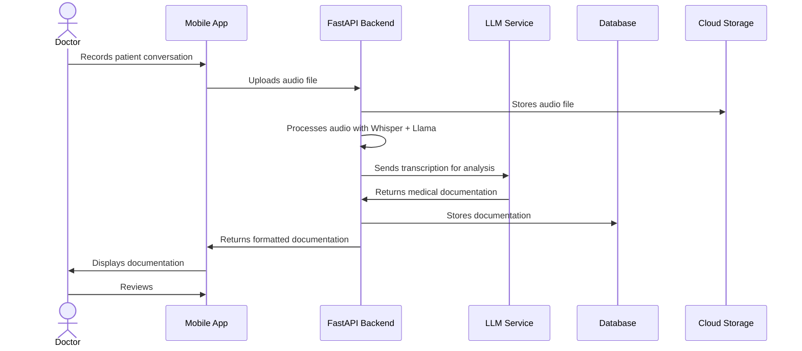

# MedVoice Core System

This is the backend for the MedVoice project, which includes the ML pipeline for Whisper-Diarization, Llama3 models, and others LLMs.

### What is MedVoice?
MedVoice is a Mobile Application that supports converting Speech to Medical Documentation format in real-time!

## Project Architecture



## Project Structure

```
MedVoice-FastAPI/
├── app/                    # Main application code
│   ├── api/                # API endpoints
│   │   └── v1/             # API version 1
│   ├── core/               # Core configuration
│   ├── crud/               # Database CRUD operations
│   ├── db/                 # Database connection and models
│   ├── llm/                # LLM integration code
│   ├── models/             # Database models
│   ├── schemas/            # Pydantic schemas
│   └── utils/              # Utility functions
├── assets/                 # Static assets
├── audios/                 # Audio file storage
├── docker/                 # Docker configuration files
├── docs/                   # Documentation
├── outputs/                # Output file storage
├── scripts/                # Utility scripts
└── static/                 # Static frontend files
    └── js/                 # JavaScript files
```

## *Before you start*
1. This `README` assumes that your machine is Debian-based. Please find the equivalent commands if you are running on a Windows or other OS.
2. This `README` assumes that your machine has enough GPU resources to run `nomic-embed-text` Ollama model. Please find the equivalent GPU Cloud Instance if your local does not have enough resources.
3. Make sure that you have turn off your VPN.

Once the application is running, the complete API documentation is available at:
- Swagger UI: `http://localhost:8000/docs`

## Build Instructions

To build the project locally, follow the steps below:

### Prerequisites
Ensure the following dependencies are installed on your machine:
- Python 3
- Docker
- Docker Compose
- For remote access: using [`ngrok` command](https://ngrok.com/docs/getting-started/)
- `make` command
- Optional for Debian-based GPU: `make nvidia`

### Steps to Set Up

1. **Clone the repository to your local machine:**
    ```shell
    git clone https://github.com/MedVoice-RMIT-CapStone-2024/MedVoice-FastAPI.git
    cd MedVoice-FastAPI
    ```

2. **Install `make` command (if not already installed):**

3. **Check for missing dependencies and configuration files:**
    ```shell
    make check
    ```
    *Resolve any missing dependencies or files as indicated in the output with Step 4*

4. **For Debian-based OS, set up the Python virtual environment and install dependencies:**
    ```shell
    make venv-all
    ```

5. **Choose your deployment mode:**

   a. **For local development:**
   - In `app/core/app_config.py`, ensure `ON_LOCALHOST` is set to 1:
     ```python
     ON_LOCALHOST = 1
     ```

   b. **For remote access (using ngrok):**
   - In `app/core/app_config.py`, ensure `ON_LOCALHOST` is set to 0:
     ```python
     ON_LOCALHOST = 0
     ```
   - Before running the command below, ensure you have a `.env` file in the root directory with the following variables:
     ```env
     NGROK_AUTH_TOKEN=your-auth-token
     NGROK_API_KEY=your-api-key (not API ID)
     NGROK_EDGE=your-edge-label
     NGROK_TUNNEL=your-tunnel-name
     ```
   - Run the following command:
     ```shell
     make ngrok
     ```

6. **Run the project with docker compose**
- If you are using a GPU/CPU, run the following command:
    ```shell
    # For GPU
    make GPU=true up
    # For CPU
    make GPU=false up
    ```

7. **[Optional] Additional utility options:**
- Export dependencies from `poetry.lock` to `requirements.txt`: 
    - `poe export`
- Import dependencies from `requirements.txt` to `poetry.lock`: 
    - `poe import`
        
## Required Environment Variables

Create an `.env` file in the project root with the following variables:

```env
# Ngrok configuration (for remote access)
NGROK_AUTH_TOKEN=your-auth-token
NGROK_API_KEY=your-api-key
NGROK_EDGE=your-edge-label
NGROK_TUNNEL=your-tunnel-name

# Google Cloud configuration
GCLOUD_PROJECT_ID=your-project-id
GCLOUD_STORAGE_BUCKET=your-bucket-name

# Ollama configuration (default is fine for local development)
OLLAMA_BASE_URL=http://host.docker.internal:11434

# Replicate API key
REPLICATE_API_TOKEN=your-replicate-api-token
```

## Obtaining the Replicate API Key

To use the Replicate API, follow these steps:

1. Visit the Replicate website at [https://www.replicate.ai](https://www.replicate.ai) and sign in.
2. Generate a new API key in your account settings.
3. Add the API key to the `.env` file as shown above.

## Setup your `google-credentials.json` file

See [docs/how-to-setup](./docs/how-to-setup-gcp-service-account.md) guide for reference

## Configuring ngrok

Run the following command to verify your ngrok configuration file:

```shell
ngrok config check
```

Use the `make ngrok` command to generate the configuration file automatically.

For more details on ngrok configuration, see the [Ngrok Documentation](https://ngrok.com/docs/agent/config/).

## License

This project is licensed under the [GNU GENERAL PL License](LICENSE).

## Reference
- [How to install NVIDIA drivers on Ubuntu](https://linuxconfig.org/how-to-install-the-nvidia-drivers-on-ubuntu-22-04)