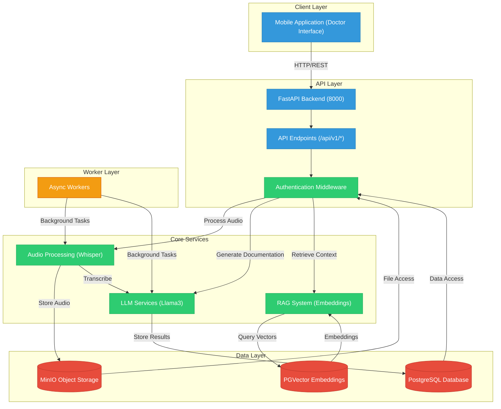

# MedVoice Core System

MedVoice is an AI-powered healthcare documentation system that automatically generates clinical documentation from doctor-patient conversations.

## Project Demo

Watch a demonstration of the MedVoice-FastAPI project:

[](https://www.youtube.com/watch?v=euxRibBCnwM)

## Project Architecture



## Project Structure

```
MedVoice-FastAPI/
├── app/                    # Main application code
│   ├── api/                # API endpoints
│   │   └── v1/             # API version 1
│   ├── core/               # Core configuration
│   ├── crud/               # Database CRUD operations
│   ├── db/                 # Database connection and models
│   ├── llm/                # LLM integration code
│   ├── models/             # Database models
│   ├── schemas/            # Pydantic schemas
│   └── utils/              # Utility functions
├── assets/                 # Static assets
├── audios/                 # Audio file storage
├── docker/                 # Docker configuration files
├── docs/                   # Documentation
├── outputs/                # Output file storage
├── scripts/                # Utility scripts
└── static/                 # Static frontend files
    └── js/                 # JavaScript files
```

## Quick Start

### Prerequisites
- Docker and Docker Compose
- Make
- Git

### Local Development Setup

1. **Clone the repository:**
   ```shell
   git clone https://github.com/MedVoice-RMIT-CapStone-2024/MedVoice-FastAPI.git
   cd MedVoice-FastAPI
   ```

2. **Verify dependencies:**
   ```shell
   make check
   ```

3. **Set up environment:**
   ```shell
   make setup
   ```
   This command creates a Python virtual environment, installs dependencies, and generates a default `.env` file.

4. **Start the application:**
   ```shell
   make up
   ```
   For GPU acceleration (if available):
   ```shell
   make GPU=true up
   ```

5. **Access the application:**
   - Web interface: http://localhost:8000
   - API documentation: http://localhost:8000/docs
   - MinIO Storage interface: http://127.0.0.1:9001
   - Flower Dashboard: http://localhost:5557/workers

## Additional Configuration

### Environment Variables

The basic configuration is handled automatically, but you can modify the following variables in your `.env` file if needed:

```env
# MinIO configuration
MINIO_ENDPOINT=minio:9000
MINIO_EXTERNAL_ENDPOINT=localhost:9000
MINIO_ACCESS_KEY=minioadmin
MINIO_SECRET_KEY=minioadmin
MINIO_SECURE=false
MINIO_BUCKET_NAME=medvoice-storage

# For AI model integration
REPLICATE_API_TOKEN=your-replicate-api-token
HF_ACCESS_TOKEN=your-hugging-face-api-token

# Ollama configuration
OLLAMA_BASE_URL=http://host.docker.internal:11434
```

### Remote Access Configuration (Optional)

For remote access using ngrok:

1. Update `app/core/app_config.py`:
   ```python
   ON_LOCALHOST = 0
   ```

2. Configure ngrok in your `.env` file:
   ```env
   NGROK_AUTH_TOKEN=your-auth-token
   NGROK_API_KEY=your-api-key
   NGROK_EDGE=your-edge-label
   NGROK_TUNNEL=your-tunnel-name
   ```

3. Generate ngrok configuration:
   ```shell
   make ngrok
   ```

## Utility Commands

- Stop the application:
  ```shell
  make down
  ```

- Export dependencies:
  ```shell
  make export
  ```

- Import dependencies:
  ```shell
  make import
  ```

## License

This project is licensed under the [GNU GENERAL PL License](LICENSE).

## Reference
- [How to install NVIDIA drivers on Ubuntu](https://linuxconfig.org/how-to-install-the-nvidia-drivers-on-ubuntu-22-04)